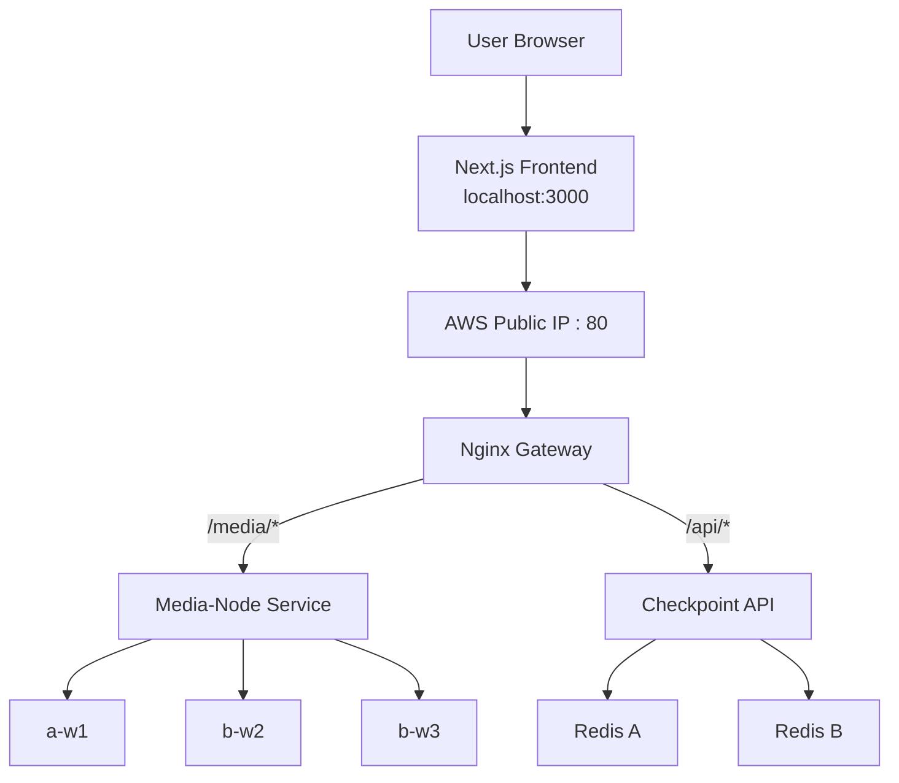

# Cloud Music — Distributed Music Streaming Prototype

A university project that demonstrates **distributed music streaming, service replication, failure recovery, and playback checkpointing** using Docker Swarm across two AWS accounts.

Songs are converted into HLS playlists and small audio segments. Three media workers store identical HLS files, allowing another worker to continue serving segments when one container or worker fails.

> **Current deployment**
>
> - Frontend: `http://localhost:3000`
> - Backend: AWS EC2 over HTTP port `80`
> - Orchestration: Docker Swarm
> - HTTPS/Caddy: not used in the current prototype

## Main Features

- Next.js music streaming interface
- HLS playback using HLS.js and HTML5 Audio
- Three replicated media workers
- Three Docker Swarm manager nodes
- Nginx gateway for `/media` and `/api` routing
- Playback checkpoint API
- Redis A and Redis B for checkpoint redundancy
- Docker Swarm self-healing and replica recovery
- Cross-account networking through VPC peering
- Manual worker, container, Redis, and manager failure testing

## System Architecture



### Request Routing

```text
/health                    -> Nginx gateway
/media/*                   -> media-node:8080
/api/checkpoint/*          -> checkpoint-api:4000
/api/media/catalog-health  -> media-node:8080
```

## Technology Stack

- **Frontend:** Next.js, React, TypeScript, Tailwind CSS
- **Streaming:** HLS.js, HTML5 Audio, FFmpeg
- **Backend:** Node.js, Express.js
- **Gateway:** Nginx
- **State storage:** Redis A and Redis B
- **Containers:** Docker
- **Orchestration:** Docker Swarm
- **Cloud:** AWS EC2, VPC, security groups, route tables, VPC peering
- **Registry:** Docker Hub

## AWS Infrastructure

The backend is distributed across two AWS accounts.

### Account A — `10.10.0.0/16`

| Node | Role | Private IP |
|---|---|---:|
| `a-m1` | Manager, public entry, Redis A placement | `10.10.2.40` |
| `a-m2` | Manager | `10.10.2.128` |
| `a-w1` | Media worker | `10.10.2.236` |

### Account B — `10.20.0.0/16`

| Node | Role | Private IP |
|---|---|---:|
| `b-m3` | Manager, Redis B placement | `10.20.2.170` |
| `b-w2` | Media worker | `10.20.2.20` |
| `b-w3` | Media worker | `10.20.2.122` |

The VPCs are connected using **VPC peering**, with route-table entries for both CIDR ranges.

Required Swarm ports between the private networks:

```text
2377/TCP       Swarm management
7946/TCP/UDP   Node communication
4789/UDP       Overlay network
```

## How Streaming Works

1. FFmpeg converts each MP3 into an HLS playlist and small `.ts` segments.
2. The same HLS files are included in each media-node image.
3. Docker Swarm runs one media replica on each worker.
4. The frontend requests a song through the Nginx gateway.
5. Nginx forwards `/media/*` requests to the logical `media-node` service.
6. Docker Swarm routes the request to an available media replica.
7. HLS.js buffers upcoming segments and plays them using HTML5 Audio.
8. The frontend periodically sends the current song position to the checkpoint API.
9. The checkpoint API attempts to write the checkpoint to both Redis services.

## Distributed-System Concepts Demonstrated

- **Access Transparency:**  
  The frontend uses one standard HTTP interface to access the backend. Users do not need separate URLs for the gateway, media workers, checkpoint API, or Redis services.

- **Location Transparency:**  
  The frontend does not know which worker node or AWS account serves a playlist or audio segment. Nginx and Docker Swarm hide the actual service location behind one public backend URL.

- **Replication Transparency:**  
  Identical HLS playlists and audio segments are stored on multiple media workers. Users see only one logical song, while Docker Swarm selects an available replica internally.

- **Failure Transparency:**  
  When a media container or worker fails, the browser can continue playing already buffered audio. HLS.js retries failed segment requests through another healthy replica, while Docker Swarm attempts to restore the required replica count.

- **Scalability Transparency:**  
  The number of service replicas can be increased or reduced without changing the frontend URL or application logic. New replicas automatically join the same logical Docker Swarm service and help handle additional requests.

  
## Repository Structure

```text
distributed-music-streaming/
├── apps/
│   ├── web/               # Next.js frontend
│   ├── gateway/           # Nginx gateway
│   ├── checkpoint-api/    # Express + Redis API
│   └── media-node/        # HLS media service
├── infra/
│   ├── docker-compose.yml
│   └── swarm-stack.yml
├── media-source/
│   ├── songs/
│   └── hls/
└── README.md
```

## Running the Local Backend

Start the local Compose stack:

```bash
docker compose -f infra/docker-compose.yml up --build
```

## Start the frontend:

```bash
cd apps/web
npm run dev
```

Open:

```text
http://localhost:3000
```

## Known Limitations

- The frontend runs on localhost.
- The backend uses HTTP instead of HTTPS.
- The frontend currently depends on one EC2 public IP.
- Songs are stored inside Docker images instead of object storage.
- Redis redundancy uses application-level dual writes.
- Authentication uses hardcoded demo users.
- No CDN, managed load balancer, autoscaling, or centralized monitoring is configured.
- The system does not guarantee zero interruption for every failure scenario.

## Security Notes

- Never commit `.pem` files or environment files.
- Restrict SSH to the administrator’s IP.
- Restrict Swarm ports to the private VPC ranges.
- Do not expose Redis publicly.
- Use only music you are legally allowed to distribute.
- Use HTTPS and restricted CORS before a public deployment.

## Contributors

- `CS/2021/034` — Dasun Adithya
- `CS/2021/007` — Kavindu Pasan
